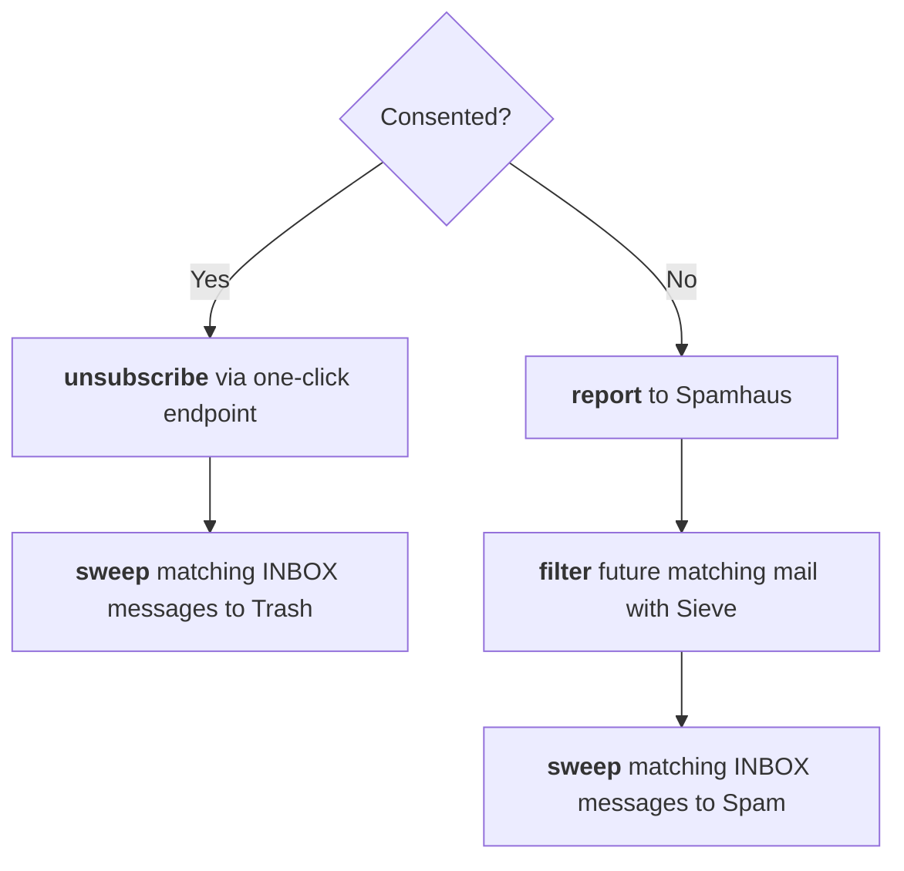

```mermaid
flowchart TD
    consent{Consented?}
    consent -->|Yes| unsubscribe["`**unsubscribe** via one-click endpoint`"]
    consent -->|No| report["`**report** to Spamhaus`"]
    unsubscribe --> trash["`**sweep** matching INBOX messages to Trash`"]
    report --> filter["`**filter** future matching mail with Sieve`"]
    filter --> spam["`**sweep** matching INBOX messages to Spam`"]
```
